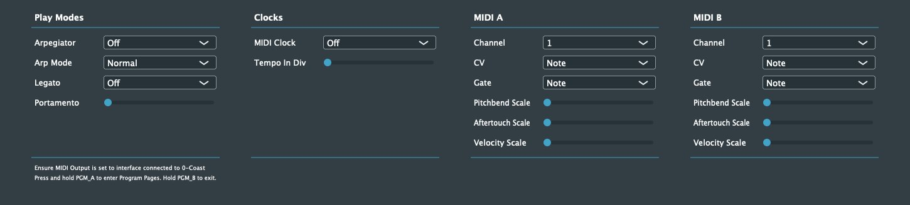

# 0-Programmer

0-Programmer is a simple application which allows you to edit the program pages of your Make Noise 0-Coast. The goal is to provide the functionality of the Make Noise Max4Live Page programmer, but in a standalone application. Simple as that :blush:

We currently support MacOS and an experimental, untested, Linux version. If there's any interest, supporting iOS and Windows could be considered. A plugin version could be interesting as well. 

_**Note: I am not affiliated with Make Noise in any way - I'm just a random guy who likes synths and noises**_

## Usage
Find and download the app in the *Releases* section to the right :arrow_right: :arrow_right: :arrow_right:

To use the app, do as follows:
1. When running the app, you may need to right-click and select "open", as the app is not certified/notarized/whatever...
2. Connect your 0-Coast to a Midi Interface
3. Select that Midi Interface the 0-Programmer Options.
4. On the 0-Coast device, press and hold PGM_A to enter program pages.
3. Have fun!

## Feedback
All feedback is welcome - please use the issue tracker! Before submitting a new issue, try to search existing issues/upcoming features and see if that resolves your problem.

# Developer Info
This section will describe the nitty-gritty of developing, testing and releasing the application. It's mostly for myself, because I forget stuff if I don't write it down. 

## Overall Structure
The app follows the basic structure of a JUCE plugin, so there's two major domains: the _Editor_ (handling the GUI) and the _Processor_ (handling realtime audio). So why do we do this if we just want to send some simple control messages in a standalone app? Well, because we want to be able to release this as a plugin later on, so keeping this structure will make this step simpler. Also, it allows us to build some bits that may be useful for other apps as well.

So, the Editor runs the GUI. A timer will trigger at a certain interval, and scan all GUI element values. Each of these values are stored in the `Parameters` class. This class will store parameters, and contains additional information such as range, which MIDI CC# to use, etc.

In case any value has changed, we'll put a message into a `MessageQueue`. When the processor/audio thread fires, it will consume any messages in the queue and send these as Midi messages to the Midi output.

Simple!

The GUI is basically just drawing a bunch of sliders/comboboxes in a number of columns. Nothing fancy or anything and the style is basic JUCE, so this could be improved.

## Test Suite Overview

### SW Tests
Tests are pretty basic, but still covers a lot of ground. Each custom class (ie. `ThreadSafeMessageQueue`, `Parameters`, etc) will have a set of unit tests covering the basic functionality of the application.

Furthermore, there's end2end tests, which try to replicate "actual" use of the application. So, this will simulate a button press in the GUI and then verify that the correct Midi message is sent into the output stream.

Finally 

### HW Tests
Hardware tests are any test which is more "hands on" and require manual interaction with the device. This is done in two ways.

* Using MidiView to manually check midi messages coming out of the app
* Connecting to a 0-Coast and verifying that parameters change as expected

## Releases
This project is based on the PampleJuce template, so releases are handled as in pamplejuce. ie: [Managing Releases](https://melatonin.dev/manuals/pamplejuce/life-with-pamplejuce/managing-releases/)

## New Features and Planning
The github issue tracker is used to track issues (duh!) and listing upcoming additions, features, fixes, etc. Feel free to add feature requests. I can't promise that any feature will be added, but I'll at least consider it.

## Contributions
PR's are welcome - fire away :blush: But, I may take some time reviewing any PR, so don't get impatient if I don't react immediately.

# Acknowledgements
This project is built using the fantastic [PAMPLEJUCE](https://github.com/sudara/pamplejuce) template - AKA the 1000hr head start for JUCE.

